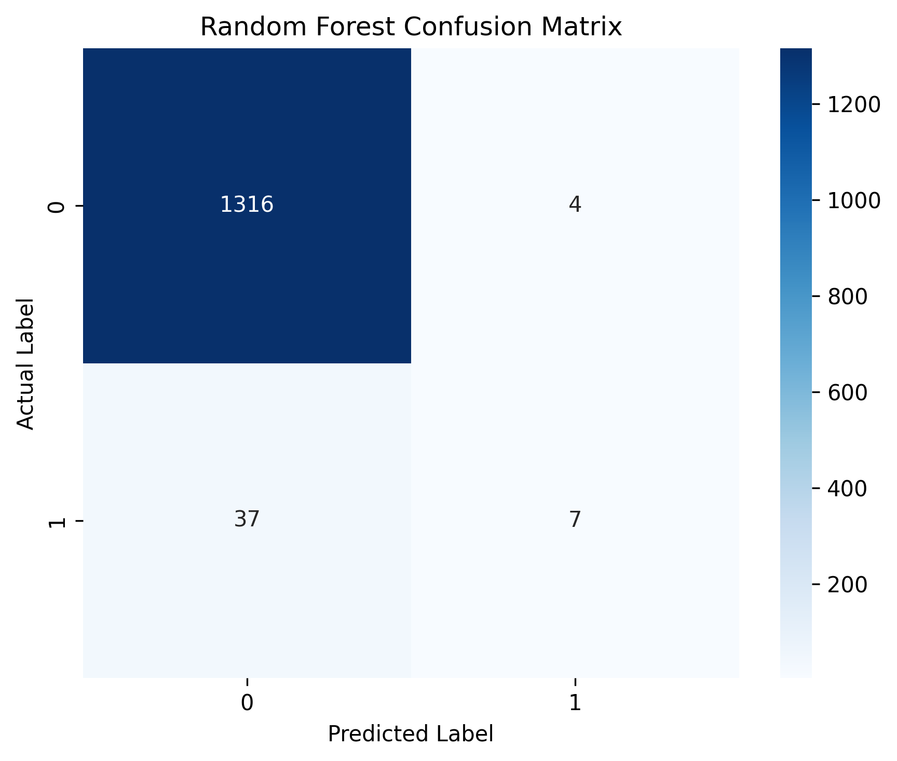
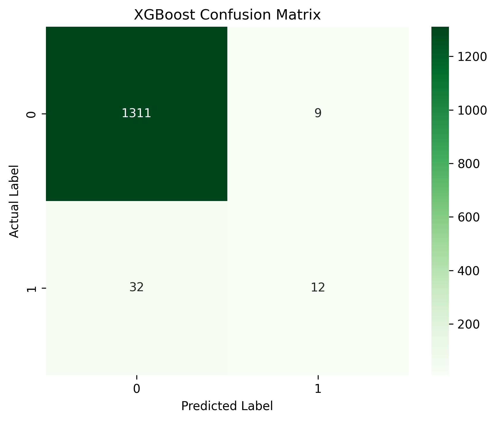
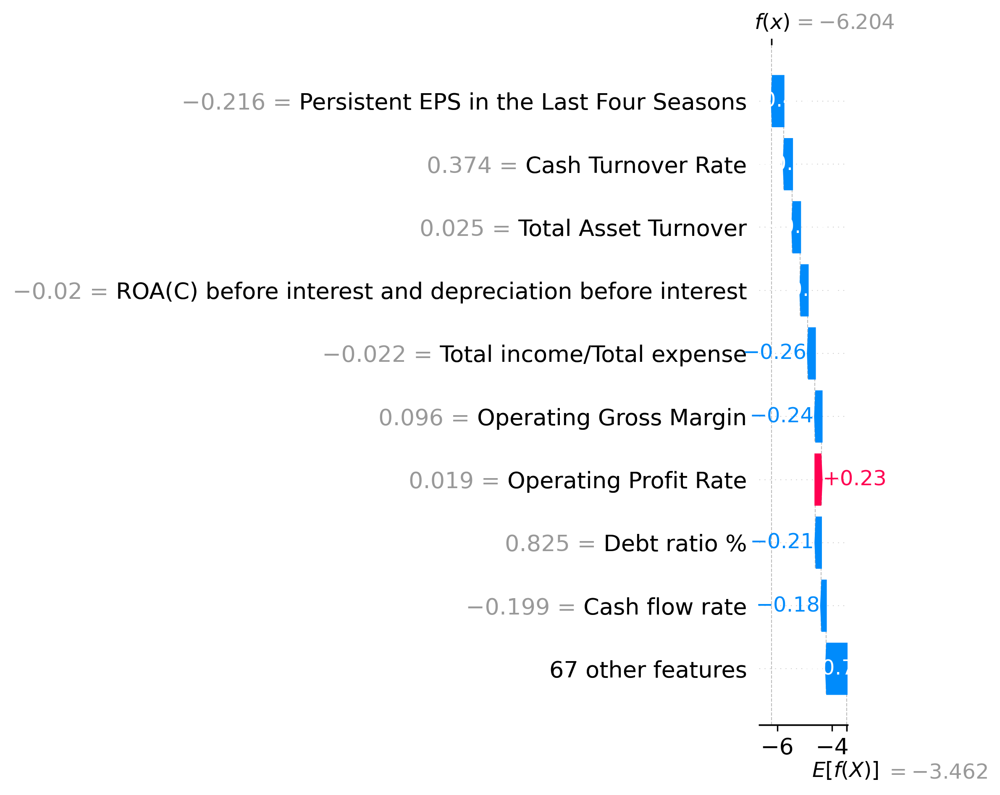

# Explainable AI for Corporate Bankruptcy Prediction Integrating Econometric and Machine Learning Approaches


---

# Overview

Financial distress prediction is a critical research problem in corporate finance, risk management, and artificial intelligence.

This project develops an interpretable machine learning framework for predicting corporate bankruptcy risk using financial indicators. The research integrates econometric modeling with advanced machine learning approaches to evaluate predictive performance while maintaining transparency through Explainable AI (XAI).

The project compares traditional statistical modeling with ensemble learning approaches and applies SHAP-based interpretation to identify the financial factors influencing model predictions.

---

# Research Objectives

The project aims to:

- Develop predictive models for corporate bankruptcy risk assessment
- Compare econometric and machine learning approaches
- Identify important financial risk indicators using Explainable AI
- Demonstrate a transparent AI framework for financial decision support

---

# Dataset

The study uses a publicly available corporate bankruptcy dataset containing financial indicators of companies.

### Dataset Characteristics

- Observations: **6,819 companies**
- Original financial variables: **96 indicators**
- Final modeling features: **76 indicators**
- Prediction task:

```
0 = Healthy company
1 = Bankrupt company
```

The dataset includes indicators related to:

- Profitability
- Liquidity
- Leverage
- Cash flow
- Asset utilization
- Operational efficiency
- Growth performance

---

# Methodology

The research workflow follows a complete machine learning pipeline:

```
Data Collection
        ↓
Data Cleaning
        ↓
Exploratory Data Analysis
        ↓
Feature Engineering
        ↓
Feature Scaling
        ↓
Model Development
        ↓
Performance Evaluation
        ↓
Explainable AI Analysis
```

---

# Predictive Models

Three classification models were developed and compared:

| Model | Purpose |
|---|---|
| Logistic Regression | Econometric baseline model with interpretability |
| Random Forest | Ensemble learning for non-linear financial relationships |
| XGBoost | Gradient boosting approach for predictive performance |

---

# Model Evaluation and Results

## Evaluation Framework

The developed models were evaluated using multiple performance metrics to provide a comprehensive assessment of predictive capability.

The evaluation framework includes:

- **Accuracy:** Overall classification correctness
- **Precision:** Ability to correctly identify financially distressed companies among predicted risk cases
- **Recall:** Ability to detect actual financially distressed companies
- **F1-score:** Balance between precision and recall
- **ROC-AUC:** Overall discrimination capability between healthy and high-risk companies
- **Confusion Matrix:** Detailed analysis of classification errors

Using multiple evaluation criteria is particularly important for bankruptcy prediction because the cost of incorrectly classifying a financially distressed company can be substantially higher than a simple accuracy measure suggests.

---

# Predictive Model Performance

Three models were developed and compared:

1. Logistic Regression as an interpretable econometric baseline
2. Random Forest as an ensemble learning approach
3. XGBoost as an advanced gradient boosting model

## Model Performance Comparison

The comparative results demonstrate that machine learning ensemble approaches provide stronger predictive capability compared with the traditional logistic regression baseline.


| Model | Accuracy | Precision | Recall | F1 Score | ROC-AUC |
|---|---:|---:|---:|---:|---:|
| Logistic Regression | 96.19% | 30.00% | 13.64% | 18.75% | 85.23% |
| Random Forest | 96.92% | 60.00% | 13.64% | 22.22% | 93.80% |
| XGBoost | 97.29% | 65.22% | 34.09% | 44.78% | 94.72% |

### Key Observation

Random Forest achieved the highest ROC-AUC score, demonstrating strong capability in distinguishing between financially healthy and distressed companies.

XGBoost achieved the highest F1-score, indicating a better balance between identifying risky companies and limiting incorrect classifications.

Although accuracy values are high, the lower recall values highlight the challenge of detecting all bankruptcy cases in an imbalanced financial risk dataset.

---

# Model Discrimination Analysis

## ROC Curve Comparison

ROC-AUC analysis evaluates how effectively each model separates financially healthy companies from distressed companies across different classification thresholds.

Higher ROC-AUC values indicate stronger discrimination capability.


---

# Classification Error Analysis

## Confusion Matrix Evaluation

Confusion matrices provide deeper insight into model errors, particularly false negatives where financially distressed companies may be incorrectly classified as healthy.

This analysis is important for financial risk applications because missed risk cases may lead to significant economic consequences.

## Random Forest Confusion Matrix




## XGBoost Confusion Matrix



---

# Explainable Artificial Intelligence Analysis

Machine learning models can achieve strong predictive performance but may lack transparency.

To address this limitation, SHAP (SHapley Additive exPlanations) was applied to identify the financial indicators influencing model predictions.

## Global Feature Importance

The SHAP analysis identifies the most influential financial variables contributing to bankruptcy risk classification.


## Individual Prediction Explanation

SHAP waterfall analysis provides a detailed explanation of how individual financial indicators contribute toward a specific model prediction.

This improves transparency by answering:

> Why was this company classified as financially risky?



---

# Exploratory Data Analysis Insights

Before model development, exploratory analysis was conducted to understand financial variable relationships and identify important patterns within the dataset.

## Correlation Structure of Financial Variables

The correlation matrix provides insights into relationships among financial indicators and helps identify potential multicollinearity patterns.


## Financial Indicators Associated with Bankruptcy Risk

Correlation analysis was used to examine financial variables showing stronger relationships with bankruptcy outcomes.

These relationships provide additional economic interpretation of the factors associated with financial distress.


---
# Key Findings

The experimental results indicate:

- Machine learning approaches achieved stronger predictive performance compared with the logistic regression baseline.
- Ensemble models successfully captured complex relationships among financial indicators.
- XGBoost achieved the strongest balance between precision and recall based on F1-score.
- SHAP analysis improved model transparency by identifying important financial drivers.

---

# Research Impact and Applications

The developed framework has potential applications in:

## Financial Institutions

- Credit risk assessment
- Early warning systems
- Portfolio risk monitoring

## Corporate Management

- Financial health monitoring
- Identification of liquidity and leverage risks
- Strategic decision support

## Investment Analysis

- Risk-based company screening
- Evidence-based investment evaluation

## Regulatory Applications

- Financial stability monitoring
- Explainable AI-supported supervision

The integration of machine learning and Explainable AI enables predictive capability while maintaining transparency and human oversight.

---

# Limitations and Future Research

## Limitations

- The analysis is based on historical financial data.
- External economic and industry factors are not included.
- Model performance requires validation on additional datasets.
- AI predictions should support expert judgement rather than replace it.

## Future Research

Future extensions may include:

- Hyperparameter optimization
- Deep learning approaches
- Time-series financial forecasting
- Integration of macroeconomic indicators
- Real-time financial risk monitoring systems

---

# Repository Structure

```
financial-risk-ai/

├── data/
│   ├── raw/
│   └── processed/

├── notebooks/
│   ├── 01_data_collection.ipynb
│   ├── 02_data_cleaning.ipynb
│   ├── 03_exploratory_analysis.ipynb
│   ├── 04_feature_engineering.ipynb
│   └── 05_modeling.ipynb

├── src/
│   ├── preprocessing.py
│   ├── feature_engineering.py
│   ├── models.py
│   ├── evaluation.py
│   ├── predict.py
│   ├── train.py
│   └── utils.py

├── models/
│   ├── logistic_regression.pkl
│   ├── random_forest.pkl
│   ├── xgboost.pkl
│   └── scaler.pkl

├── figures/
│   ├── model_comparison.png
│   ├── roc_curve_comparison.png
│   ├── shap_feature_importance.png
│   ├── confusion_matrix_xgboost.png
│   ├── confusion_matrix_random_forest.png
│   ├── correlation_heatmap.png
│   └── bankruptcy_correlation.png

├── results/
│   ├── model_comparison.csv
│   └── shap_feature_importance.csv

├── reports/
│   └── financial_risk_analysis_report.md

├── examples/
│   └── predict_example.py

├── README.md
├── REFERENCES.md
├── CITATION.cff
├── LICENSE
└── requirements.txt

---

# Technologies

### Programming

- Python

### Data Analysis

- Pandas
- NumPy
- Matplotlib
- Seaborn

### Machine Learning

- Scikit-learn
- Random Forest
- XGBoost

### Explainable AI

- SHAP

### Development Environment

- Google Colab
- Jupyter Notebook
- GitHub

---

## Reproducible Training Pipeline

The project implements a modular machine learning pipeline.

Run:

```bash
python -m src.train
---

# Research Contribution

This project demonstrates a framework combining:

- Econometric financial reasoning
- Machine learning prediction
- Explainable Artificial Intelligence

The research highlights how AI-based financial risk models can achieve predictive performance while maintaining interpretability, transparency, and responsible deployment principles.

---

# Author

Muhammad Siddique, PhD

Research Interests:

- Artificial Intelligence
- Machine Learning
- Economic & Financial Analytics
- Econometric Modeling
- Explainable AI
- Quantitative Research

- # References

For detailed academic references, see [REFERENCES.md]
