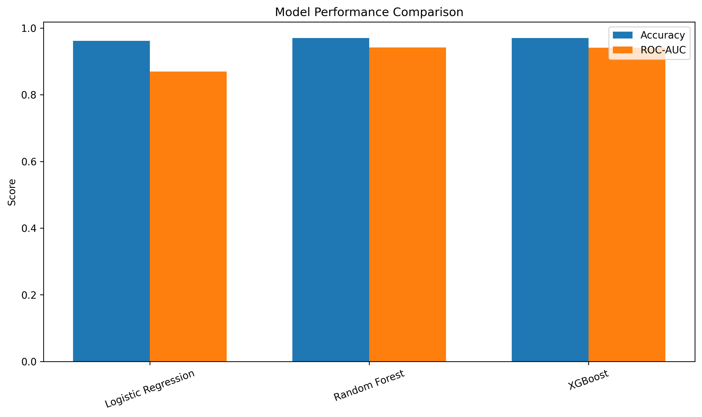
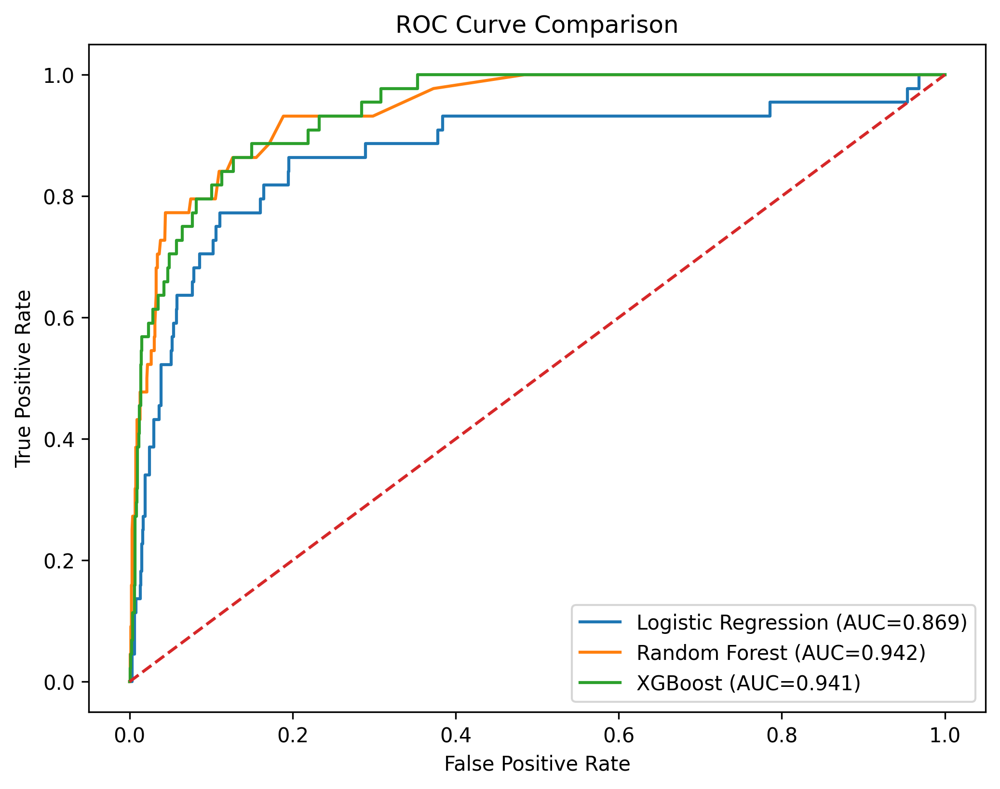
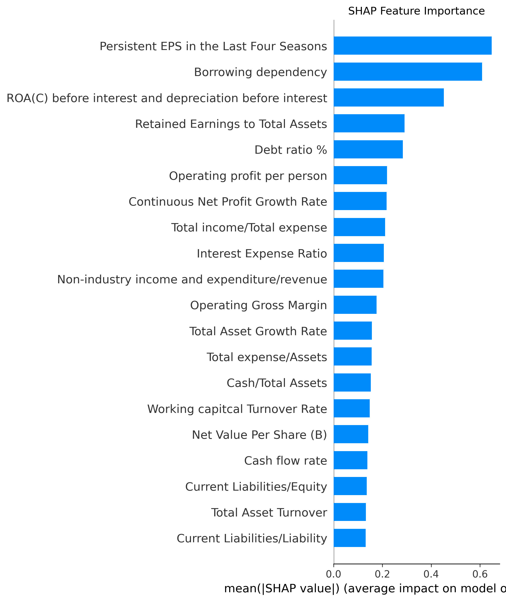
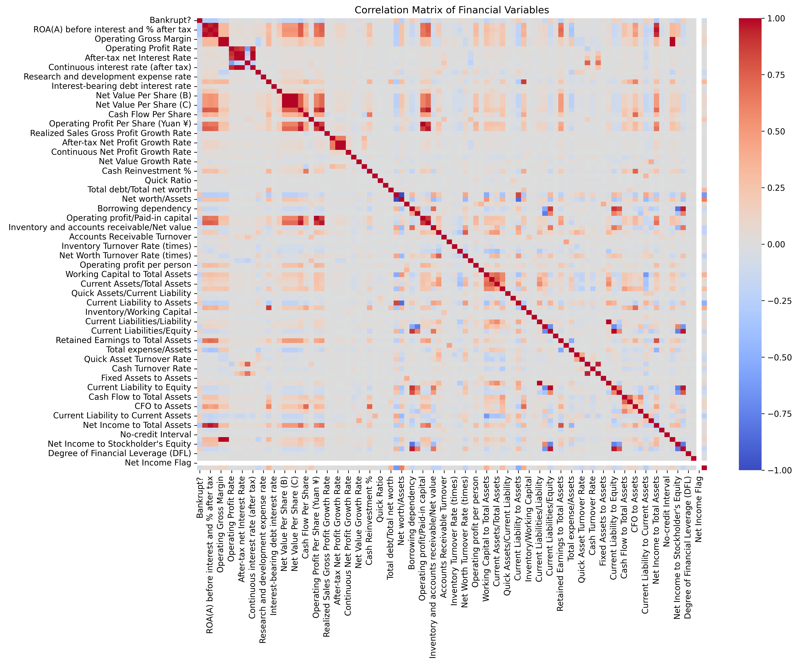
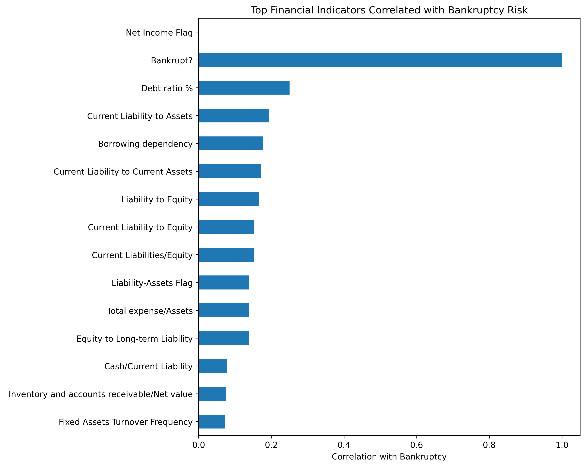

# Financial Risk Prediction Using Econometric and Machine Learning Approaches


---

# Overview

Financial distress prediction is a critical research problem in corporate finance, risk management, and artificial intelligence.

This project develops an interpretable machine learning framework for predicting corporate bankruptcy risk using financial indicators. The research integrates econometric modeling with advanced machine learning approaches to evaluate predictive performance while maintaining transparency through Explainable AI (XAI).

The project compares traditional statistical modeling with ensemble learning approaches and applies SHAP-based interpretation to identify the financial factors influencing model predictions.

---

# Research Objectives

The project aims to:

- Develop predictive models for corporate bankruptcy risk assessment
- Compare econometric and machine learning approaches
- Identify important financial risk indicators using Explainable AI
- Demonstrate a transparent AI framework for financial decision support

---

# Dataset

The study uses a publicly available corporate bankruptcy dataset containing financial indicators of companies.

### Dataset Characteristics

- Observations: **6,819 companies**
- Original financial variables: **96 indicators**
- Final modeling features: **76 indicators**
- Prediction task:

```
0 = Healthy company
1 = Bankrupt company
```

The dataset includes indicators related to:

- Profitability
- Liquidity
- Leverage
- Cash flow
- Asset utilization
- Operational efficiency
- Growth performance

---

# Methodology

The research workflow follows a complete machine learning pipeline:

```
Data Collection
        ↓
Data Cleaning
        ↓
Exploratory Data Analysis
        ↓
Feature Engineering
        ↓
Feature Scaling
        ↓
Model Development
        ↓
Performance Evaluation
        ↓
Explainable AI Analysis
```

---

# Predictive Models

Three classification models were developed and compared:

| Model | Purpose |
|---|---|
| Logistic Regression | Econometric baseline model with interpretability |
| Random Forest | Ensemble learning for non-linear financial relationships |
| XGBoost | Gradient boosting approach for predictive performance |

---

# Model Evaluation

Models were evaluated using:

- Accuracy
- Precision
- Recall
- F1-score
- ROC-AUC
- Confusion Matrix

---

# Results

## Model Performance Comparison





| Model | Accuracy | Precision | Recall | F1 Score | ROC-AUC |
|---|---:|---:|---:|---:|---:|
| Logistic Regression | 96.19% | 30.00% | 13.64% | 18.75% | 86.94% |
| Random Forest | 96.99% | 63.64% | 15.91% | 25.45% | 94.18% |
| XGBoost | 96.99% | 57.14% | 27.27% | 36.92% | 94.08% |

---

# Model Interpretation

## ROC Curve Analysis

ROC-AUC evaluation demonstrates the ability of each model to distinguish between financially healthy and distressed companies.




## Explainable AI Analysis

SHAP (SHapley Additive exPlanations) was applied to interpret model predictions and identify influential financial indicators.



---

# Exploratory Data Analysis

## Financial Variable Relationships

Correlation analysis was performed to understand relationships among financial indicators.




## Bankruptcy Risk Indicators

The analysis explored financial variables associated with bankruptcy outcomes.



---

# Key Findings

The experimental results indicate:

- Machine learning approaches achieved stronger predictive performance compared with the logistic regression baseline.
- Ensemble models successfully captured complex relationships among financial indicators.
- XGBoost achieved the strongest balance between precision and recall based on F1-score.
- SHAP analysis improved model transparency by identifying important financial drivers.

---

# Research Impact and Applications

The developed framework has potential applications in:

## Financial Institutions

- Credit risk assessment
- Early warning systems
- Portfolio risk monitoring

## Corporate Management

- Financial health monitoring
- Identification of liquidity and leverage risks
- Strategic decision support

## Investment Analysis

- Risk-based company screening
- Evidence-based investment evaluation

## Regulatory Applications

- Financial stability monitoring
- Explainable AI-supported supervision

The integration of machine learning and Explainable AI enables predictive capability while maintaining transparency and human oversight.

---

# Limitations and Future Research

## Limitations

- The analysis is based on historical financial data.
- External economic and industry factors are not included.
- Model performance requires validation on additional datasets.
- AI predictions should support expert judgement rather than replace it.

## Future Research

Future extensions may include:

- Hyperparameter optimization
- Deep learning approaches
- Time-series financial forecasting
- Integration of macroeconomic indicators
- Real-time financial risk monitoring systems

---

# Repository Structure

```
financial-risk-ai/

├── data/
│   ├── raw/
│   └── processed/
│
├── notebooks/
│   ├── 01_data_collection.ipynb
│   ├── 02_data_cleaning.ipynb
│   ├── 03_exploratory_analysis.ipynb
│   ├── 04_feature_engineering.ipynb
│   └── 05_modeling.ipynb
│
├── results/
│   ├── model_comparison.csv
│   └── shap_feature_importance.csv
│
├── figures/
│   ├── model_comparison.png
│   ├── roc_curve_comparison.png
│   ├── shap_feature_importance.png
│   ├── correlation_heatmap.png
│   └── bankruptcy_correlation.png
|
├── src/
├── preprocessing.py
├── feature_engineering.py
├── models.py
├── evaluation.py
└── predict.py
├── README.md
└── requirements.txt
```

---

# Technologies

### Programming

- Python

### Data Analysis

- Pandas
- NumPy
- Matplotlib
- Seaborn

### Machine Learning

- Scikit-learn
- Random Forest
- XGBoost

### Explainable AI

- SHAP

### Development Environment

- Google Colab
- Jupyter Notebook
- GitHub

---

# Reproducibility

Clone the repository:

```bash
git clone https://github.com/muhammad-siddique-research/financial-risk-ai.git
```

Install dependencies:

```bash
pip install -r requirements.txt
```

Run notebooks sequentially:

1. Data Collection
2. Data Cleaning
3. Exploratory Analysis
4. Feature Engineering
5. Modeling and Evaluation

---

# Research Contribution

This project demonstrates a framework combining:

- Econometric financial reasoning
- Machine learning prediction
- Explainable Artificial Intelligence

The research highlights how AI-based financial risk models can achieve predictive performance while maintaining interpretability, transparency, and responsible deployment principles.

---

# Author

**Muhammad Siddique**

Research Interests:

- Artificial Intelligence
- Machine Learning
- Economic & Financial Analytics
- Econometric Modeling
- Explainable AI
- Quantitative Research

- # References

For detailed academic references, see [REFERENCES.md]
